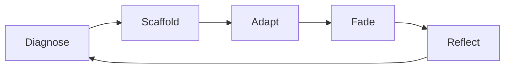

# The Learning Model

Scafflow is built around a **five-stage learning loop**. Every feature should map to one of these stages. If it does not, question whether it belongs in the product.

---

## 1. Diagnose

**Where does the student start?**

Before and during problem solving, Scafflow forms a picture of the learner: how they focus, how much agency they want, how confident they feel on relevant topics, and how they are behaving on the current problem (progress, engagement, help-seeking).

Diagnosis is **continuous**, not a one-time label. The initial profile is only a starting point.

---

## 2. Scaffold

**What is the next useful step?**

Scaffolding breaks complex problems into manageable pieces—or, for advanced learners, stays out of the way. The same homework problem can be presented as many small guided steps, as method-choice branches, as merged high-density screens, or as a single open workspace.

Scaffolding teaches **process**, not just answers. Feedback confirms reasoning along the way.

---

## 3. Adapt

**How should support change right now?**

As the student works, Scafflow adjusts: more structure when they are lost, simpler next steps when cognitive load is high, timely hints when they are stuck, or lighter touch when they are flowing.

Adaptation responds to **learner state**—not only to whether an answer was right or wrong.

---

## 4. Fade

**How do we grow independence?**

Support should decrease as competence and confidence grow within a session and across assignments. The aim is transfer: students eventually solve similar problems with less scaffolding.

Fading is intentional. A profile that starts heavy should not stay heavy forever if the student no longer needs it.

---

## 5. Reflect

**What carries to the next problem?**

The system and the student benefit from closure: what worked, what was hard, what strategies transferred. Reflection informs the next cycle of diagnose → scaffold → adapt → fade.

---

## Productive Struggle

The loop is designed to preserve **productive struggle**: difficulty that promotes learning, not helplessness. Scafflow does not hide AI from learning—it makes AI support **accountable** to learning. Help is available, but it is shaped so students still do the reasoning homework is meant to develop.
