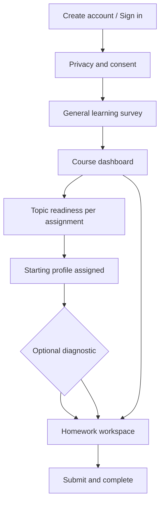

# Student Journey

This is the end-to-end experience a student should have—not how any particular system implements it.

---

## 1. Arrival

The student arrives through their course context—registration or sign-in tied to their role as an enrolled learner. The first impression should be: *this is homework support for my class*, not a generic AI tool.

---

## 2. Privacy and Consent

Before meaningful learning data is collected, the student understands what is stored, how it is used, and agrees to participate under institutional privacy expectations (e.g., FERPA at U.S. universities). **Consent is a gate**, not a footnote.

---

## 3. General Learning Survey

A structured self-report (on the order of twenty items) across learning-related dimensions: attention, autonomy, competence, self-regulation, and self-efficacy. Language should feel relevant to **coursework**, not generic workplace training.

This survey is **periodic**—not repeated before every problem set.

---

## 4. Course Dashboard

The student sees their course(s) and assigned homework sets—mirroring how they would approach work in a learning management flow. They pick an assignment when ready.

---

## 5. Topic Readiness (Per Assignment)

Before opening a specific homework set, the student rates confidence on the concepts that assignment covers. This is lighter than the full learning survey and keeps support aligned with **this week’s material**.

---

## 6. Profile Assignment

Based on accumulated signals, Scafflow sets a **starting support profile** (1–4). The student should understand that this shapes their experience but does not define their worth or permanent ability.

---

## 7. Optional Diagnostic

Short calibration problems may run before or alongside early homework to refine the system’s sense of skill on key topics. This is optional in product terms but valuable for cold-start accuracy.

---

## 8. Homework Workspace

The core experience:

- The assigned problem and circuit (or equivalent STEM representation) are always visible
- Steps, method pickers, input fields, and interactive canvas elements match the student’s profile
- Feedback addresses **reasoning**, not only final numbers
- Help is available on demand; prompts may also appear when the student appears stuck
- The student can accept help, ignore it, request more, or continue independently

---

## 9. Completion and Return

After submission, the student returns to the dashboard for the next assignment. Over time, scaffolding should **fade** as independence grows. Reflection on what transferred may be lightweight (summary, encouragement) or richer in future versions.

---

## Returning Students

Sign-in → dashboard → (topic readiness if new assignment) → homework. The general learning survey reappears only on the intended refresh cadence, not every session.
