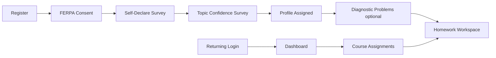

# Product Overview

**Purpose:** Support product, scope, and persona decisions for Scafflow.

**Last reviewed:** 2026-06-24

**Related files:** [02-system-architecture.md](02-system-architecture.md), [07-onboarding-and-profiles.md](07-onboarding-and-profiles.md), [09-status-and-decisions.md](09-status-and-decisions.md)

**Canonical source:** `docs/sprint3-backend-design.md`

---

## What Is Scafflow?

Scafflow (repo folder name; npm packages: `scaffolding-backend` / `scaffolding-frontend`) is an **adaptive AI tutoring system for ECE students** learning circuit analysis. It delivers:

- **Profile-conditioned scaffolds** — multi-step problem flows tailored to learner type
- **Real-time adaptive hints** — streaming AI guidance modulated by cognitive and skill state
- **Skill tracking** — per-topic tiers (0–3) updated from attempt and hint signals

Topics covered: **KVL, KCL, phasors, impedance, Thévenin/Norton** (enum value `thevenin`).

Target launch context: June 2026 MVP for UW course integration.

---

## Target Users

- **Primary:** University of Washington ECE students
- **Login pattern:** NetID → synthesized email `<netid>@uw.edu` (see [09-status-and-decisions.md](09-status-and-decisions.md))
- **Course context:** Demo flow uses "Circuit Theory" (Autumn 2026); course ID `ee-xxx` in dashboard

---

## Core Value Proposition

Students working circuit homework often get stuck without personalized, low-latency feedback. Scafflow closes that gap with:

1. **Deterministic adaptive engine** (Sprints 1–2) — skill tiers, stress blending, intervention triggers
2. **Streaming AI tutor** (Sprint 3, partial) — Anthropic Claude hints via SSE
3. **Scaffolded problem workspace** — step-by-step flows (MCQ, numeric, planning, circuit drawing) per learner profile

---

## Scope

### In scope (MVP)

- Student auth (email + password, JWT cookie)
- FERPA consent logging and onboarding pipeline
- Problem bank with profile-specific variants and steps
- Session lifecycle (Postgres + Redis)
- Adaptive thresholds and skill tier updates
- AI hint streaming (`POST /api/hints`)
- Frontend SPA for auth, onboarding, dashboard, problem workspace

### Out of scope (explicit)

- Instructor dashboard
- SSO / OAuth (NetID is synthesized to email, not true SSO)
- Batch hint pre-generation
- Frontend rendering owned by backend design docs (backend serves built SPA in production)

---

## Sprint History

| Sprint | Dates | Status | Focus |
|--------|-------|--------|-------|
| Sprint 1 | Apr 14–27 | Done | Auth, schema, Redis sessions, onboarding API, problem DB |
| Sprint 2 | Apr 28–May 11 | Done | Skill updater, cognitive state, adaptive engine, interventions |
| Sprint 3 | May 12–25+ | In progress | AI tutor (hints implemented; feedback & auto-hint wiring incomplete) |

See [09-status-and-decisions.md](09-status-and-decisions.md) for current implementation detail.

---

## Learner Personas (Profile 1–4)

Four learner profiles drive scaffold depth, hint pacing, and UI tone. Mapping between UI profile numbers, database enum, and Figma personas:

| Profile # | DB `LearnerProfile` | Figma persona | Scaffold character |
|-----------|---------------------|---------------|-------------------|
| 1 | `starter` | Alex | Most heavily scaffolded (~17 steps for Thévenin) |
| 2 | `exploring` | Jordan | ADHD-friendly; fewer steps (~11) |
| 3 | `distracted` | Priya | Grad-level; moderate scaffold (~13) |
| 4 | `independent` | Advanced | Minimal scaffold (stub in Figma) |

Source: `src/services/profile-classifier.ts` — `LEARNER_TO_PROFILE_NUMBER`, `PROFILE_TO_LEARNER`.

Profile assignment comes from a **21-item self-report survey** plus topic confidence scores (see [07-onboarding-and-profiles.md](07-onboarding-and-profiles.md)).

---

## High-Level User Journey

Consent is a **launch blocker** — backend rejects onboarding writes until `consent_given_at` is set. The consent UI is still a placeholder in the frontend.

---

## Key Constraints (Non-Negotiable)

These affect every product and engineering decision:

1. **FERPA / IRB** — email stored as SHA-256 hash only; consent logged append-only; audit tables are immutable
2. **No ground truth leakage** — `ground_truth_answer` and MCQ `is_correct` never sent to client
3. **Numeric grading** — ±1% tolerance; never string match on floats
4. **JWT in httpOnly cookie** — not localStorage (XSS mitigation)

---

## Repository Naming

| Name | Where |
|------|-------|
| Scafflow | Git repo folder |
| scaffolding-backend | Root `package.json` |
| scaffolding-frontend | `frontend/package.json` |

When communicating externally, "Scafflow" is the product name; package names reflect the original "scaffolding" project label.
