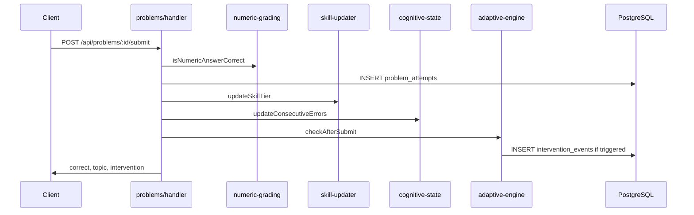

# Adaptive Engine (Implemented)

**Purpose:** Support decisions about tutoring logic, skill assessment, interventions, and AI hints.

**Last reviewed:** 2026-06-24

**Related files:** [03-data-model-and-domain.md](03-data-model-and-domain.md), [05-api-reference.md](05-api-reference.md), [10-future-roadmap.md](10-future-roadmap.md) (proposed changes)

**Canonical sources:** `src/services/skill-updater.ts`, `src/services/cognitive-state.ts`, `src/services/adaptive-engine.ts`, `src/services/ai-tutor.ts`

> This document covers **implemented behavior only**. Proposed `alternative_track` and anti-gaming signals are in [10-future-roadmap.md](10-future-roadmap.md).

---

## Overview

The adaptive system has four layers:

1. **Skill updater** — tier changes per topic after each attempt
2. **Cognitive state** — stress blend from self-report + behavior
3. **Adaptive engine** — intervention triggers on threshold breach
4. **AI tutor** — streaming hints personalized by profile

All deterministic logic (1–3) is pure-function services with no Express dependency. Layer 4 calls Anthropic.

---

## Skill Tiers (0–3)

Each student has a tier **per topic** in `student_skills`. Tier drives problem difficulty selection and hint personalization.

### Hysteresis Rule

Requires **2 consecutive signals** in the same direction before tier changes — prevents thrashing on lucky/unlucky answers.

| Event | Counter behavior | Tier change |
|-------|------------------|-------------|
| Correct, 0 hints used | `consecutive_up++`, reset down | At 2 → tier up (max 3) |
| Hint budget exhausted | `consecutive_down++`, reset up | At 2 → tier down (min 0) |
| Correct with hints (budget not exhausted) | Reset both counters | No change |
| Incorrect, budget remaining | No counter change | No change |

Source: `src/services/skill-updater.ts`

### Problem Selection

`GET /api/problems/next` picks the **weakest skill topic** (lowest tier), then maps tier → difficulty:

| Tier | Difficulty |
|------|------------|
| 0, 1 | easy |
| 2 | medium |
| 3 | hard |

Random problem within `(topic, difficulty)`.

---

## Cognitive State and Stress

### Stress Blend Formula

```
stress_level = round(
  self_report_weight × checkin_value +
  (1 − self_report_weight) × behavioral_stress
)
```

- `self_report_weight = max(0.2, 0.8 − 0.1 × sessions_completed)` — early sessions trust self-report more
- `behavioral_stress = min(2, errorScore + idlePressure)` where idle pressure = 1 if idle exceeds threshold
- Result clamped to 0, 1, or 2

Source: `src/services/cognitive-state.ts` — `recalcStressAndThresholds()`

### Threshold Rewriting

After stress recalculation, `adaptive_config` is rewritten based on `adhd_flag`, `stress_level`, and `course_level`:

| Profile | idle_threshold_s | error_threshold | hint_budget | response_length |
|---------|------------------|-----------------|-------------|-----------------|
| High need (ADHD or stress=2) | 60 | 2 | 4 | brief |
| Advanced course | 180 | 4 | 2 | short |
| Default | 90 | 3 | 3 | medium |

Initial thresholds also set at onboarding via `computeAdaptiveThresholds()` in `src/services/onboarding-survey.ts`.

### Consecutive Errors

- Wrong answer → `consecutive_errors++`, triggers stress recalc
- Correct answer → reset to 0, triggers stress recalc

---

## Intervention Triggers

`checkAfterSubmit()` in `src/services/adaptive-engine.ts` runs after each answer submission.

| Trigger | Condition | Logged to |
|---------|-----------|-----------|
| `error_streak` | `consecutive_errors >= error_threshold` | `intervention_events` |
| `hint_budget_exhausted` | `hints_used >= hint_budget` | `intervention_events` |

There is no idle intervention trigger in `adaptive-engine.ts` today despite `idle` being a valid hint trigger type.

Returns trigger to caller for client relay. Does **not** auto-stream hints yet (see [10-future-roadmap.md](10-future-roadmap.md)).

**Note:** `idle_threshold_s` affects stress blending in `cognitive-state.ts` (idle pressure when `idle_streak_s >= threshold`) but there is **no session heartbeat endpoint** in the codebase today, and `adaptive-engine.ts` does not emit an idle intervention trigger. Idle-based hint triggers are accepted by `POST /api/hints` if the client sends `trigger_type: "idle"`.

---

## Post-Submit Pipeline



Scaffold step submit (`POST /api/problems/:id/steps/:stepId/submit`) follows similar grading in `src/api/problems/scaffold.ts` with MCQ, numeric, and circuit canvas grading.

---

## Multi-Step Scaffolds

Profile-specific problem flows via `problem_variants` + `problem_steps`.

### Variant Selection

1. Read student's `learner_profile` from `students`
2. Default to `starter` if null (pre-onboarding)
3. Look up variant for `(problem_id, learner_profile)`
4. Fall back to `starter` variant if student's profile has no variant

### Step Types

| Type | Grading |
|------|---------|
| `mcq` | Compare submitted key to option with `is_correct: true` |
| `numeric` | ±tolerance vs `ground_truth_answer` |
| `planning`, `open` | Ungraded (`correct: null`) |
| `drawing_task` | Circuit canvas interaction check (`src/lib/circuit-canvas.ts`) |

Misconception hints returned when triggers match student answer pattern.

See `docs/scaffold-api.md` for full endpoint contract.

---

## AI Hints (Sprint 3 — Partial)

### Implemented

- `POST /api/hints` — SSE stream from Anthropic Claude
- Model: `ANTHROPIC_HINT_MODEL` env (default `claude-haiku-4-5`)
- Reads `student_profile` view + problem context
- Personalizes by: stress level, tier, hint depth, response length budget
- Logs to `hint_events` (append-only)
- Updates Redis `hints_used_this_problem`
- Enforces hint budget (409 if exhausted, except `hint_budget_exhausted` trigger)

### Request

```json
{
  "session_id": "uuid",
  "problem_id": "uuid",
  "trigger_type": "manual | idle | error_streak | hint_budget_exhausted"
}
```

### Response

`Content-Type: text/event-stream` — SSE chunks until done.

### Prompt Constraints

- Never reveals ground truth answer
- Hard sentence cap based on `response_length_budget` (short/brief/medium)
- Tone shifts calmer when `stress_level === 2`
- Uses problem `error_taxonomy[]` for misconception-aware hints

Source: `src/services/ai-tutor.ts`, `src/api/hints/handler.ts`

### Not Yet Implemented

- `POST /api/feedback` — targeted error feedback
- Auto-hint on intervention trigger (wire engine → hint handler)
- Hint absorption tracking on next submit
- Frontend hint UI panel

See [09-status-and-decisions.md](09-status-and-decisions.md) and [10-future-roadmap.md](10-future-roadmap.md).

---

## Event Ingestion

`POST /api/events` accepts client events including `checkin_response`. Check-ins update cognitive state via `updateFromCheckin()` and append to `checkin_responses`.

---

## Key Design Decisions

| Decision | Rationale |
|----------|-----------|
| 2-consecutive hysteresis | Prevents tier thrash |
| Thresholds in DB, not computed at check time | Simple reads; config is source of truth |
| Self-report weight decays with sessions | Early sessions lack behavioral data |
| Redis for session hot state | Sub-50ms reads vs ~5–15ms Postgres |
| Numeric ±1% tolerance | Float answers vary in representation |
| Services as pure functions | Independently testable without Express |
