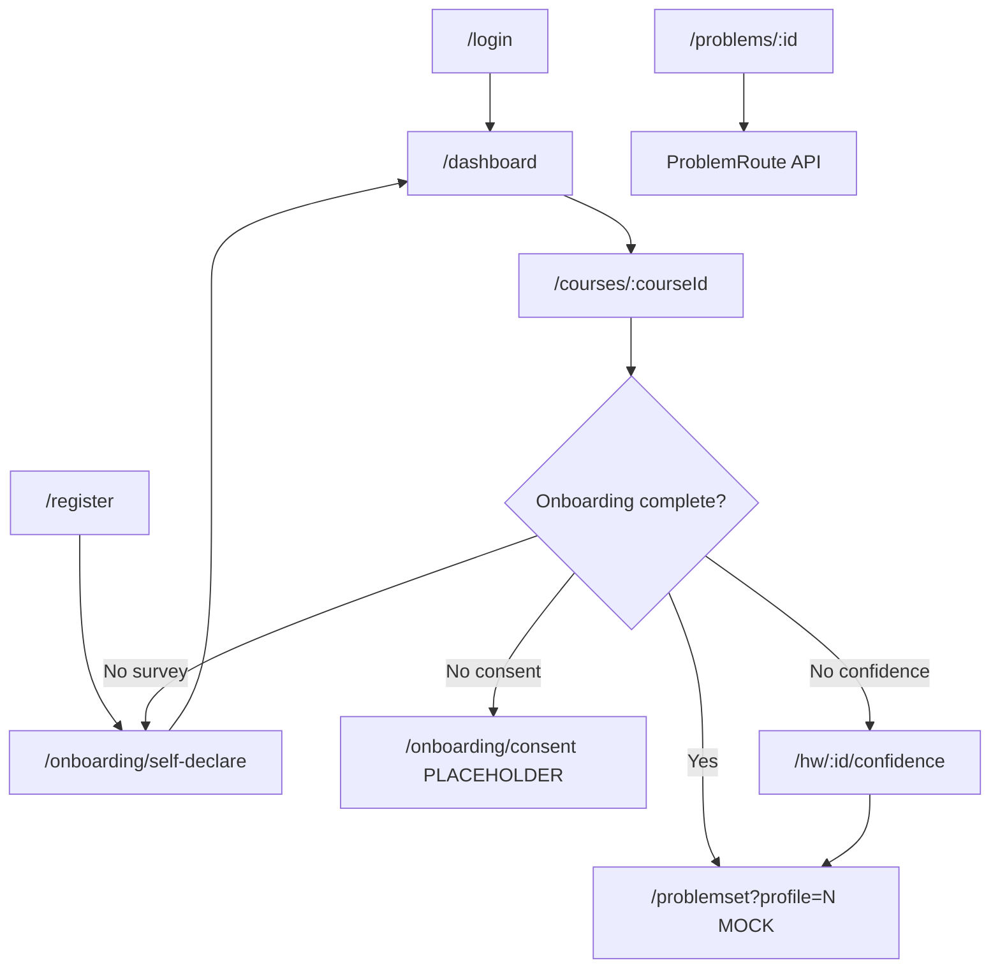

# Frontend and UX

**Purpose:** Support UI, routing, component, and design-system decisions.

**Last reviewed:** 2026-06-24

**Related files:** [05-api-reference.md](05-api-reference.md), [07-onboarding-and-profiles.md](07-onboarding-and-profiles.md), [09-status-and-decisions.md](09-status-and-decisions.md)

**Canonical sources:** `frontend/src/router.tsx`, `frontend/src/lib/api.ts`, `HANDOFF.md`

---

## Stack Summary

| Layer | Choice |
|-------|--------|
| Framework | React 19 SPA (not Next.js) |
| Build | Vite 6 — dev port 5173 |
| Routing | React Router 7 — `createBrowserRouter` |
| Styling | Tailwind CSS v4 + global CSS in `frontend/src/styles/index.css` |
| State | Local `useState` / `useEffect` only — no Redux, Zustand, or Context |
| API | Single module `frontend/src/lib/api.ts` |
| Math | KaTeX (`MathText`, `MathAnswerInput`), mathjs |

---

## Route Table

From `frontend/src/router.tsx`:

| Path | Component | Status |
|------|-----------|--------|
| `/`, `/login` | `LoginRoute` | Implemented — NetID login |
| `/register` | `RegisterRoute` | Implemented — account + inline consent checkbox |
| `/dashboard` | `DashboardRoute` | Implemented — hardcoded course card |
| `/courses/:courseId` | `CourseAssignmentsRoute` | Implemented — HW list + onboarding gate |
| `/courses/:courseId/hw/:hwId/confidence` | `ConfidenceSurveyRoute` | Implemented — topic proficiency → profile |
| `/onboarding` | `SelfDeclareRoute` | Alias redirect |
| `/onboarding/consent` | `ConsentRoute` | **Placeholder** — launch blocker |
| `/onboarding/self-declare` | `SelfDeclareRoute` | Implemented — 21-item survey |
| `/onboarding/diagnostic` | `DiagnosticRoute` | **Placeholder** |
| `/problemset`, `/design/problem` | `DesignProblemRoute` | Implemented — mock workspace (local fixtures) |
| `/problems`, `/problems/:id` | `ProblemRoute` | Implemented — API-backed workspace |
| `/design/showcase` | `DesignShowcaseRoute` | Implemented — design review grid |

**Orphan:** `HomeRoute.tsx` exists but is not registered in the router.

**Redirects:** `/...` → `/dashboard`, `/dashboard.` → `/dashboard`

---

## User Flow



### Onboarding Gate Logic

`CourseAssignmentsRoute.openHomework()` calls `onboarding.status()`:

1. No consent → `/onboarding/consent`
2. No self-declare → `/onboarding/self-declare`
3. No confidence/profile → `/courses/:courseId/hw/:n/confidence`
4. Complete → `/problemset?profile={profileNumber}`

---

## Two Problem Workspace Implementations

This split is **critical for decisions** — do not assume one replaces the other yet.

### Mock/Design Workspace — `DesignProblemRoute`

- **Paths:** `/problemset`, `/design/problem`
- **Data:** Local fixtures in `frontend/src/design/mockSteps.ts`
- **Profile select:** `?profile=1|2|3|4` query param
- **Grading:** Client-side only (`circuitCanvas.ts` for drawing steps)
- **Purpose:** Visual contract from Figma; step UI polish before full API wiring
- **Comment in code:** "Stage 4 will wire to `problems.getScaffold` and `problems.submitStep`"

### Live API Workspace — `ProblemRoute`

- **Paths:** `/problems`, `/problems/:id`
- **Data:** `problems.get()`, `problems.getScaffold()`, `sessions.create()`
- **Submit:** `problems.submitStep()` per scaffold step
- **Purpose:** End-to-end integration with backend
- **UI:** Simpler than design workspace — uses scaffold API types, not full Figma step components

**Decision implication:** Homework flow currently navigates to **mock** workspace (`/problemset`). Wiring to live `/problems/:id` is a pending integration step.

---

## Component Organization

```
frontend/src/
├── routes/              # Page-level components (13 files)
├── components/          # Shared app components
│   ├── AppShell.tsx     # Layout wrapper for onboarding placeholders
│   ├── InteractiveCircuitCanvas.tsx
│   ├── MathText.tsx, MathAnswerInput.tsx
│   └── ResizableSplitPane.tsx
├── design/
│   ├── components/      # Figma-aligned homework workspace
│   │   ├── WorkspaceFrame, Sidebar, StepCard, Feedback
│   │   ├── CircuitDiagram, Scratchpad, OptionCircuit
│   │   └── steps/       # Step-kind subcomponents (9 files)
│   ├── mockSteps.ts     # Static fixtures per profile
│   └── types.ts         # Step discriminated union (design contract)
├── hooks/
│   └── useScratchpadCanvas.ts
├── lib/
│   ├── api.ts           # Typed API client (ONLY place for fetch)
│   └── circuitCanvas.ts # Client-side canvas grading (design route)
└── styles/
    └── index.css        # Tailwind import + CSS variables
```

### Step Dispatch Pattern

`StepCard` renders by `step.kind` from `frontend/src/design/types.ts`:

| Kind | Component |
|------|-----------|
| `mcq` | `McqStep` |
| `numeric_plain` | `NumericPlainStep` |
| `numeric_unit` | `NumericUnitStep` |
| `multi_value` | `MultiValueStep` |
| `labeled_equations` | `LabeledEquationsStep` |
| `priors_then_input` | `PriorsThenInputStep` |
| `dual_numeric_unit` | `DualNumericUnitStep` |
| `drawing_task` | `DrawingTaskStep` |
| `select_in_diagram` | `SelectInDiagramStep` |

Design types include `empty | filled | checked` states inline for showcase rendering.

---

## Design System

| Token | Value |
|-------|-------|
| Font | IBM Plex Sans (Google Fonts in `index.html`) |
| Background | `#F8F9FA` |
| Border | `#E5E7EB` |
| Accent / primary | `#615FFF` (indigo) |
| Muted text | `#5D5D5D` |
| Input background | `#F9FBFC` |

### Styling Rules (from HANDOFF)

- **Tailwind classes only** — no inline styles, no per-component CSS files
- Match Figma colors exactly when present
- Global CSS for shell patterns: `.app-shell`, `.panel`, `.meta-grid`
- KaTeX stylesheet imported in `main.tsx`

### Forms

- React `useState` — no form library
- All network calls through `src/lib/api.ts` — never raw `fetch` in components

---

## Auth UX Details

### Login (`LoginRoute`)

- User enters NetID (not full email)
- Sends `<netid>@uw.edu` to `auth.login()`
- "Forgot password?" → `alert()` placeholder — **no backend endpoint**

### Register (`RegisterRoute`)

- Collects display name, NetID, password
- Inline consent checkbox (calls `consent: true` on register)
- On success → `/onboarding/self-declare`
- Note: separate consent screen still required for users who skip register consent path

---

## Figma Integration

| Item | Value |
|------|-------|
| Design file key | `qWB8UPBr4Us99ABkRspWRQ` |
| MCP server | `figma-developer-mcp` via `.mcp.json` |
| Workflow | Paste single-frame URL → generate Tailwind component → wire route + API |

### Figma Inventory Status

| Section | Status |
|---------|--------|
| Login | Done |
| Onboarding surveys | Partially done (combined into SelfDeclareRoute) |
| Dashboard variants | Not built |
| Profile 1 flow (~32 frames) | Design components exist; mock route only |
| Profile 2 flow (~30 frames) | Same |
| Profile 3 flow (~13 frames) | Same |
| Profile 4 (3 frames) | Stub |
| Settings (5 frames) | Not built |
| AI hint UI frame | Not identified / not built |

Full MCP setup: `docs/claude-code-figma-mcp.md` (tool-specific, not in project context).

---

## Dev Configuration

| File | Purpose |
|------|---------|
| `frontend/vite.config.ts` | Port 5173, proxy `/api` → `localhost:3000` |
| `frontend/.env.example` | `VITE_API_BASE_URL=http://localhost:3000` |
| `frontend/.env.development` | Local defaults |

Build: `npm run build` from `frontend/` runs `tsc -b && vite build`

---

## Conventions for Contributors

1. **One change at a time** — avoid large multi-file refactors in a single PR
2. Components in `routes/` or `components/` or `design/components/`
3. Type-check: `npx tsc -b` from `frontend/` must pass
4. Network calls only via `api.ts`
5. When adding routes, update `router.tsx`

---

## Known Frontend Gaps

See [09-status-and-decisions.md](09-status-and-decisions.md):

- Consent screen (launch blocker)
- Diagnostic flow UI
- AI hint panel (backend SSE ready)
- Unify mock design workspace with live API workspace
- Dashboard Figma variants
- Survey question copy (workplace-themed → ECE context)
