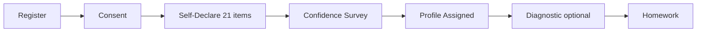

# Onboarding and Learner Profiles

**Purpose:** Support decisions about learner classification, survey design, and onboarding flow.

**Last reviewed:** 2026-06-24

**Related files:** [01-product-overview.md](01-product-overview.md), [05-api-reference.md](05-api-reference.md), [09-status-and-decisions.md](09-status-and-decisions.md)

**Canonical sources:** `profile-classification-README.md`, `src/services/profile-classifier.ts`, `src/api/onboarding/`

---

## Onboarding Pipeline (Ordered Gates)



| Step | API | Frontend route | Blocks if missing |
|------|-----|----------------|-------------------|
| 1. Register | `POST /api/auth/register` | `/register` | Account creation |
| 2. FERPA consent | `POST /api/onboarding/consent` | `/onboarding/consent` | All onboarding writes |
| 3. Self-declare | `POST /api/onboarding/self-declare` | `/onboarding/self-declare` | Confidence survey |
| 4. Confidence | `POST /api/onboarding/confidence` | `/courses/.../confidence` | Profile assignment |
| 5. Diagnostic | `POST /api/onboarding/diagnostic` | `/onboarding/diagnostic` | `cold_start_done` flag |
| 6. Homework | — | `/problemset` or `/problems/:id` | — |

**Launch blocker:** Step 2 consent UI is a placeholder. Backend rejects declaration/self-declare if `consent_given_at` is NULL.

**Register shortcut:** Register route includes inline consent checkbox (`consent: true`) which may set consent at registration — but dedicated consent screen still needed for returning users and compliance UX.

---

## Learner Profile Mapping

| Profile # | Label | DB enum | Persona | Scaffold depth |
|-----------|-------|---------|---------|----------------|
| 1 | Profile1 | `starter` | Alex | Most steps (~17 Thévenin) |
| 2 | Profile2 | `exploring` | Jordan | ADHD-friendly (~11 steps) |
| 3 | Profile3 | `distracted` | Priya | Grad-level (~13 steps) |
| 4 | Profile4 | `independent` | Advanced | Minimal (stub) |

Mapping constants in `src/services/profile-classifier.ts`:
- `PROFILE_TO_LEARNER` — Profile1→starter, etc.
- `LEARNER_TO_PROFILE_NUMBER` — starter→1, etc.

Scaffold API selects `problem_variants` by `learner_profile`, falling back to `starter`.

---

## Classification Input: 21-Item Questionnaire

Five constructs, each item scored 1–5:

| Construct | Items | Interpretation |
|-----------|-------|----------------|
| Attention Difficulty | 5 | Higher = more difficulty |
| Autonomy | 4 | Higher = more autonomy |
| Competence | 4 | Higher = more competence |
| Self-Regulation | 4 | Higher = stronger regulation |
| Self-Efficacy | 4 | Higher = stronger efficacy |

Frontend collects these in `SelfDeclareRoute` across 5 sections (Attention uses frequency scale; others use agreement scale).

---

## Scoring Algorithm

### Step 1 — Construct Score

```
ConstructScore = Sum(item scores) / Number of items
```

### Step 2 — Level Mapping

| Score range | Level |
|-------------|-------|
| 1.00 – 2.75 | Low |
| 2.76 – 3.50 | Medium |
| 3.51 – 5.00 | High |

### Step 3 — Profile Match Score

For each profile (1–4), count how many construct levels satisfy that profile's requirements (max score = 5).

**Profile rules:**

| Profile | Self-Efficacy | Self-Regulation | Attention | Autonomy | Competence |
|---------|---------------|-----------------|-----------|----------|------------|
| 1 | Low | Low | High | Low | Low |
| 2 | Low or Med | Low | Low or Med | Med or High | Low or Med |
| 3 | Med or High | Med or High | High | Med or High | Medium |
| 4 | High | High | Low | High | Med or High |

("Med" = Medium)

### Step 4 — Assignment

```
AssignedProfile = profile with highest match score
```

### Step 5 — Tie Breaking

If tied, break using construct priority order:
1. Self-Efficacy
2. Self-Regulation
3. Attention Difficulty
4. Autonomy
5. Competence

Higher ordinal level wins for profiles requiring High; lower wins for Low requirements.

### Step 6 — Confidence

```
Confidence = HighestProfileScore / 5
```

If highest score < 3 → flag as `Ambiguous`.

### Step 7 — Map to DB Enum

Profile1→`starter`, Profile2→`exploring`, Profile3→`distracted`, Profile4→`independent`.

Stored in `students.learner_profile`. Raw responses stored in `learner_survey_responses` (JSONB).

Implementation: `classify()` in `src/services/profile-classifier.ts`

---

## Topic Confidence Overlay

Separate from construct scores. Collected in `ConfidenceSurveyRoute`:

| Topic key | Label |
|-----------|-------|
| `thevenin_norton` | Thevenin Norton Equivalent |
| `mesh_current` | Mesh Current |
| `node_voltage` | Node Voltage Analysis |
| `kirchhoff_law` | Kirchhoff Law |

Each scored 1–5: Not Familiar → Expert.

```
TopicConfidenceScore = Sum(answered) / Count(answered)
```

Used as domain-readiness overlay — **does not replace** Self-Efficacy or Competence in classification. Returned in classification response as `topicConfidenceScore`.

---

## Adaptive Threshold Initialization

On self-declare, `computeAdaptiveThresholds()` sets initial `adaptive_config` from:

- `adhd_flag`
- `stress_baseline` (derived from Attention section average)
- `course_level`

| Condition | idle_s | errors | hints | response |
|-----------|--------|--------|-------|----------|
| High need (ADHD or stress=2) | 60 | 2 | 4 | brief |
| Advanced course | 180 | 4 | 2 | short |
| Default | 90 | 3 | 3 | medium |

Stress baseline derivation (`deriveStressBaseline`):
- Average attention items → mapped to 0, 1, or 2

Source: `src/services/onboarding-survey.ts`

---

## Legacy Declaration Endpoint

`POST /api/onboarding/declaration` — older 3-question flow (ADHD flag, stress baseline, course level). Still available but superseded by self-declare + confidence flow for profile assignment.

---

## Diagnostic Cold-Start

After profile assignment, optional diagnostic:

1. `GET /api/onboarding/problems` — 3 problems
2. Student submits numeric answers
3. `POST /api/onboarding/diagnostic` — grades, seeds `student_skills` tiers, sets `cold_start_done = true`

Frontend diagnostic route is **placeholder** — API is ready.

---

## Onboarding Status API

`GET /api/onboarding/status` returns:

```json
{
  "consentGiven": true,
  "selfDeclareComplete": true,
  "confidenceComplete": true,
  "learnerProfile": "starter",
  "profileNumber": 1
}
```

Used by course assignment gate before opening homework.

---

## Known Content and Data Issues

| Issue | Detail | Decision needed |
|-------|--------|-----------------|
| Workplace-themed questions | Some survey copy references "work" not coursework | Design rewrite for ECE |
| Sections 2–4 partially unused | Only Attention section feeds `stress_baseline` today | Persist all sections? New table? |
| Consent UX split | Register has checkbox; dedicated consent screen is placeholder | Unified FERPA flow |
| Diagnostic vs main-loop frames | Figma frames not labeled which are diagnostic vs homework | Design team clarification |

---

## Error Cases

| Status | Meaning |
|--------|---------|
| 400 | Invalid input, missing consent, incomplete survey |
| 409 | Self-declare not complete before confidence |
| ValidationError | Item scores outside 1–5 |
| Incomplete | Missing required construct items |

---

## Full Specification

For complete tie-breaking examples, ambiguous classification rules, and missing-data handling, see `profile-classification-README.md` at repo root. This document captures decision-relevant rules; the README is the authoritative algorithm spec.
