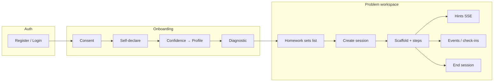

---

## Classification key

| Label                    | Meaning                                      |
| ------------------------ | -------------------------------------------- |
| **Preserve**             | Keep contract and behavior in the rewrite    |
| **Modify intentionally** | Known change required                        |
| **Deprecate**            | Superseded or should not carry forward       |
| **Unknown**              | Gap or inconsistency requiring investigation |

There are **no cron jobs, workers, or queues** — all runtime behavior is HTTP request-driven or CLI scripts.

---

## Cross-cutting concerns

| Area             | Current implementation                                                                                                                                    | Rewrite requirement            | Classification           |
| ---------------- | --------------------------------------------------------------------------------------------------------------------------------------------------------- | ------------------------------ | ------------------------ |
| Authentication   | JWT in httpOnly `token` cookie; `requireAuth` reads cookie, verifies `JWT_SECRET`, sets `req.studentId` from `sub`                                        | Preserve cookie behavior       | **Preserve**             |
| Student identity | Email → SHA-256 hash (`email.toLowerCase().trim()`); raw email never stored; bcrypt cost 12                                                               | Must remain unchanged          | **Preserve**             |
| Sessions         | Postgres `sessions` row on create/end; Redis `session:{id}` hot state (24h TTL); cache miss rehydrates partial state from Postgres                        | Define source of truth         | **Modify intentionally** |
| Numeric grading  | Relative tolerance via `isNumericAnswerCorrect()` — `abs(submitted − truth) / abs(truth) ≤ tolerance`; zero-GT special case; default tolerance 0.01 (±1%) | Preserve exactly               | **Preserve**             |
| Consent          | `consent_given_at` gate on onboarding writes; append-only `consent_log`; register can set consent inline                                                  | Preserve enforcement           | **Preserve**             |
| Hints            | Anthropic streaming over SSE (`text/event-stream`, token chunks + `event: done`); logs `hint_events`; updates Redis hint count                            | Preserve streaming semantics   | **Preserve**             |
| Skill updates    | `skill-updater.ts` — 2-consecutive hysteresis; tier 0–3                                                                                                   | Port with parity tests         | **Preserve**             |
| Audit records    | Postgres `RULE` blocks UPDATE/DELETE on audit tables                                                                                                      | Database-enforced immutability | **Preserve**             |

**Session source-of-truth note:** Redis holds live counters (`consecutive_errors`, `idle_streak_seconds`, `hints_used_this_problem`, `hint_history`) but most of that is **not written back** to Postgres. Only `current_step_id` is synced on scaffold advance. `ai-tutor.ts` reads `current_problem_state` from **Postgres**, not Redis — the two stores can diverge.

---

## Student journey (how APIs connect)

---

## Auth — account access

| Method | Path                 | Purpose in app                                                                                                              | Current behavior                                                                                                                                                                                    | Classification |
| ------ | -------------------- | --------------------------------------------------------------------------------------------------------------------------- | --------------------------------------------------------------------------------------------------------------------------------------------------------------------------------------------------- | -------------- |
| POST   | `/api/auth/register` | Onboard a new student so they can enter the course flow with a personalized skill model and adaptive settings from day one. | Creates account (SHA-256 email hash, bcrypt password), initializes `cognitive_state`, `adaptive_config`, `student_skills` (4 topics @ tier 1), optional consent + `consent_log`, issues JWT cookie. | **Preserve**   |
| POST   | `/api/auth/login`    | Return an existing student to their dashboard and in-progress work without re-onboarding.                                   | Validates email hash + bcrypt (dummy hash if missing row); issues JWT cookie.                                                                                                                       | **Preserve**   |
| POST   | `/api/auth/logout`   | End the browser session cleanly (e.g. shared computer, sign-out).                                                           | Clears `token` cookie.                                                                                                                                                                              | **Preserve**   |

---

## Onboarding — gate before tutoring

| Method | Path                           | Purpose in app                                                                                                              | Current behavior                                                                                                  | Classification |
| ------ | ------------------------------ | --------------------------------------------------------------------------------------------------------------------------- | ----------------------------------------------------------------------------------------------------------------- | -------------- |
| POST   | `/api/onboarding/consent`      | Record FERPA/IRB consent so research and profile data collection is legally allowed before any survey or diagnostic.        | Appends `consent_log`; sets `consent_given_at` when granted (idempotent).                                         | **Preserve**   |
| POST   | `/api/onboarding/declaration`  | Legacy shortcut to capture ADHD flag, stress baseline, and course level in one step (older flow before the 21-item survey). | Sets `adhd_flag`, stress, thresholds, optional `learner_profile`; consent-gated.                                  | **Deprecate**  |
| POST   | `/api/onboarding/self-declare` | Learn how the student learns (attention, autonomy, competence, etc.) to calibrate stress and intervention thresholds.       | Stores 21-item Likert survey in `learner_survey_responses`; derives stress from attention items; sets thresholds. | **Preserve**   |
| POST   | `/api/onboarding/confidence`   | Assign a learner profile (starter / exploring / distracted / independent) that controls scaffold depth and tutoring style.  | Runs `profile-classifier` from self-declare + topic confidence; sets `learner_profile`.                           | **Preserve**   |
| GET    | `/api/onboarding/status`       | Drive onboarding UI routing — show consent screen, self-declare, confidence, or send user to homework.                      | Returns completion flags + assigned profile (does not expose `cold_start_done`).                                  | **Preserve**   |
| GET    | `/api/onboarding/problems`     | Present the cold-start diagnostic — three problems to estimate initial skill levels before adaptive homework.               | Returns 3 problems by `course_level` (no ground truth); consent-gated.                                            | **Preserve**   |
| POST   | `/api/onboarding/diagnostic`   | Finish onboarding by grading diagnostic answers and unlocking the main problem workspace.                                   | Grades 3 answers (±1%); seeds tiers (correct→2, wrong→1); sets `cold_start_done`; creates onboarding session.     | **Preserve**   |

---

## Sessions — one work sitting on a problem

| Method | Path                    | Purpose in app                                                                                               | Current behavior                                                     | Classification                        |
| ------ | ----------------------- | ------------------------------------------------------------------------------------------------------------ | -------------------------------------------------------------------- | ------------------------------------- |
| POST   | `/api/sessions`         | Start a work session when a student opens a problem so hints, steps, and interventions are tracked together. | Inserts Postgres session; seeds Redis with default hot state.        | **Modify intentionally**              |
| GET    | `/api/sessions/:id`     | Resume workspace state after refresh or reconnect (current step, hints used, draft work).                    | Returns Postgres row + Redis state; 404 if ended.                    | **Modify intentionally**              |
| POST   | `/api/sessions/:id/end` | Close a session when the student leaves a problem so completion stats and cleanup run.                       | Sets `ended_at`, increments `sessions_completed`, deletes Redis key. | **Preserve** (semantics; storage TBD) |

---

## Problems — the core tutoring loop

| Method | Path                                     | Purpose in app                                                                                                        | Current behavior                                                                                             | Classification |
| ------ | ---------------------------------------- | --------------------------------------------------------------------------------------------------------------------- | ------------------------------------------------------------------------------------------------------------ | -------------- |
| GET    | `/api/problems/next`                     | Suggest the next problem targeted at the student's weakest topic (adaptive homework path).                            | Picks weakest skill tier → difficulty map → random problem.                                                  | **Preserve**   |
| GET    | `/api/problems/:id`                      | Load a single problem for display in the workspace (statement, topic, taxonomy — not the answer).                     | Public problem fields only (no `ground_truth_answer`).                                                       | **Preserve**   |
| POST   | `/api/problems/:id/submit`               | Grade a final numeric answer for simpler single-shot problems and trigger skill/adaptive updates.                     | Numeric grade → `problem_attempts` → skill tier → cognitive state → intervention check.                      | **Preserve**   |
| GET    | `/api/problems/:id/scaffold`             | Load the step-by-step guided path tailored to the student's learner profile (e.g. 17 steps vs fewer for independent). | Returns ordered steps for profile variant; strips MCQ `is_correct`; optional `session_id` for step position. | **Preserve**   |
| POST   | `/api/problems/:id/steps/:stepId/submit` | Grade one scaffold step (MCQ, numeric, canvas, planning) and advance through the guided sequence.                     | Grades step, logs `problem_step_attempts`, advances `current_step_id` in Redis + Postgres when accepted.     | **Unknown**    |

**Scaffold submit note:** `submitStep` does **not** call `skill-updater`, `cognitive-state`, or `adaptive-engine`. Only single-shot `submit` runs the full adaptive pipeline.

---

## Hints — AI tutoring during struggle

| Method | Path         | Purpose in app                                                                                                                                    | Current behavior                                                                                                                             | Classification |
| ------ | ------------ | ------------------------------------------------------------------------------------------------------------------------------------------------- | -------------------------------------------------------------------------------------------------------------------------------------------- | -------------- |
| POST   | `/api/hints` | Deliver a personalized Socratic hint when the student is stuck, idle, on an error streak, or out of hint budget — without giving away the answer. | Anthropic SSE stream; enforces hint budget (409 unless `trigger_type: hint_budget_exhausted`); logs `hint_events`; updates Redis hint count. | **Preserve**   |

---

## Events — telemetry and self-report

| Method | Path          | Purpose in app                                                                                                   | Current behavior                                                                                         | Classification |
| ------ | ------------- | ---------------------------------------------------------------------------------------------------------------- | -------------------------------------------------------------------------------------------------------- | -------------- |
| POST   | `/api/events` | Capture client-side signals (check-ins, idle, snapshots) for research audit trails and stress/threshold updates. | Multiplexes into append-only tables; `checkin_response` updates cognitive state via `updateFromCheckin`. | **Preserve**   |

**Supported `event_type` values:** `problem_attempt`, `hint_event`, `intervention_event`, `state_snapshot`, `checkin_response`.

---

## Homework sets — course navigation

| Method | Path                 | Purpose in app                                                                                | Current behavior                                                                     | Classification |
| ------ | -------------------- | --------------------------------------------------------------------------------------------- | ------------------------------------------------------------------------------------ | -------------- |
| GET    | `/api/homework-sets` | Show assignment lists on the course page with which problems the student has already started. | Lists problem sets + nested problems + per-student `attempted` (from step attempts). | **Preserve**   |

---

## Infrastructure

| Method | Path      | Purpose in app                                                          | Current behavior             | Classification |
| ------ | --------- | ----------------------------------------------------------------------- | ---------------------------- | -------------- |
| GET    | `/health` | Confirm the API is up for deploy checks, load balancers, and local dev. | `{ status: "ok" }`; no auth. | **Preserve**   |

---

## Middleware, error handling, and static serving

| Area                           | Purpose in app                                                                  | Current behavior                                                                               | Classification |
| ------------------------------ | ------------------------------------------------------------------------------- | ---------------------------------------------------------------------------------------------- | -------------- |
| `requireAuth`                  | Ensure only logged-in students access tutoring and personal data.               | Cookie JWT verify; 401 on missing/invalid.                                                     | **Preserve**   |
| `asyncHandler`                 | Prevent unhandled promise rejections from crashing the server.                  | Async errors → global 500 handler.                                                             | **Preserve**   |
| Helmet + CORS                  | Allow the SPA to call the API with cookies from the configured frontend origin. | CORS from `FRONTEND_URL`; credentials enabled.                                                 | **Preserve**   |
| Global error handler           | Consistent error shape for the frontend client.                                 | 500 JSON `{ error: "Internal server error" }`.                                                 | **Preserve**   |
| Static frontend + SPA fallback | Serve the built React app from the same origin in production.                   | Serves `frontend/dist` when `NODE_ENV !== 'test'`.                                             | **Unknown**    |
| Security stripping             | Prevent answer leakage and PII exposure.                                        | No `ground_truth_answer` in public responses; MCQ `is_correct` stripped; email never returned. | **Preserve**   |

---

## Request-triggered service behaviors

These run inline inside handlers — not separate background jobs.

| Behavior                         | Purpose in app                                                                                                                | Triggered by                                    | Current logic                                                                        | Classification           |
| -------------------------------- | ----------------------------------------------------------------------------------------------------------------------------- | ----------------------------------------------- | ------------------------------------------------------------------------------------ | ------------------------ |
| Skill tier hysteresis            | Adapt difficulty over time — reward clean solves, penalize repeated hint reliance, without flipping tier on one lucky answer. | `POST .../submit` (single-shot only)            | 2-consecutive up/down per topic in `skill-updater.ts`.                               | **Preserve**             |
| Cold-start tier seeding          | Bootstrap skill model before homework so "next problem" and hints aren't generic.                                             | `POST /api/onboarding/diagnostic`               | correct→tier 2, wrong→tier 1 (not hysteresis).                                       | **Preserve**             |
| Consecutive error tracking       | Tune how aggressively the app intervenes based on recent wrong answers.                                                       | Single-shot submit                              | Wrong++ / correct reset → stress recalc.                                             | **Preserve**             |
| Stress blend + threshold rewrite | Adjust hint budget, error tolerance, and response length to student stress and profile.                                       | After errors; after checkin; onboarding surveys | Weight decay + behavioral blend → rewrite `adaptive_config`.                         | **Preserve**             |
| Intervention triggers            | Tell the UI when to offer help (error streak, hint budget exhausted).                                                         | Single-shot submit only                         | `error_streak`, `hint_budget_exhausted` → `intervention_events`; returned to client. | **Preserve**             |
| Profile classification           | Pick the right teaching style — more steps and support vs lighter guidance.                                                   | `POST /api/onboarding/confidence`               | 21-item constructs → learner profile.                                                | **Preserve**             |
| Adaptive threshold init          | Set starting intervention sensitivity at account creation and onboarding.                                                     | Register; declaration; self-declare             | ADHD/stress/course_level matrix via `computeAdaptiveThresholds()`.                   | **Preserve**             |
| AI hint prompt assembly          | Personalize hint tone, depth, and length without revealing the answer.                                                        | `POST /api/hints`                               | Profile + problem + tier + taxonomy; socratic/direct depth.                          | **Preserve**             |
| Circuit canvas grading           | Grade interactive circuit steps (ground node, mesh short).                                                                    | Scaffold step submit                            | `gradeCircuitCanvas()` in `lib/circuit-canvas.ts`.                                   | **Preserve**             |
| Numeric grading                  | Consistent float answer checking across all grading paths.                                                                    | Submit, diagnostic, scaffold numeric steps      | Shared `isNumericAnswerCorrect()` in `lib/numeric-grading.ts`.                       | **Preserve**             |
| Redis session cache              | Keep the workspace responsive while the student steps through a long scaffold.                                                | Session create/read/hint/scaffold               | 24h TTL; rehydrate on miss from partial Postgres columns.                            | **Modify intentionally** |
| Client event ingestion           | Support IRB/research with client-origin telemetry and self-reports.                                                           | `POST /api/events`                              | Writes append-only audit rows; check-ins update cognitive state.                     | **Preserve**             |
| Append-only audit writes         | Immutable record of attempts, hints, consent, and interventions.                                                              | Submits, hints, interventions, events, consent  | Postgres rules block UPDATE/DELETE on audit tables.                                  | **Preserve**             |

---

## Documented but not implemented

| Planned item                             | Purpose in app                                                                             | Documented in              | Classification               |
| ---------------------------------------- | ------------------------------------------------------------------------------------------ | -------------------------- | ---------------------------- |
| `POST /api/sessions/:id/heartbeat`       | Detect idle students and trigger idle-based hints or stress updates.                       | sprint3 design, stale docs | **Unknown**                  |
| `POST /api/feedback`                     | Explain a specific mistake using the problem's error taxonomy after a wrong answer.        | sprint3 design             | **Modify intentionally**     |
| Auto-hint on intervention                | Proactively stream a hint when thresholds fire, without a manual "ask for hint" click.     | sprint3 design             | **Unknown**                  |
| Hint absorption (`hint_events.absorbed`) | Measure whether hints helped before the next attempt (research/analytics).                 | sprint3 design             | **Unknown**                  |
| `alternative_track` skill signal         | Additional skill signal for abandoned problems.                                            | adaptive-signal-design     | **Deprecate** or **Unknown** |
| Forgot password                          | Account recovery.                                                                          | HANDOFF                    | **Deprecate**                |
| Idle intervention trigger                | Server-driven idle intervention (distinct from client-sent `trigger_type: idle` on hints). | adaptive-engine docs       | **Unknown**                  |

---

## CLI / operational scripts (not runtime API)

| Script                                | Purpose                           | Classification             |
| ------------------------------------- | --------------------------------- | -------------------------- |
| `src/db/migrate.ts`                   | Apply `schema.sql`                | **Preserve**               |
| `scripts/import-problems.ts`          | Seed problem bank                 | **Preserve**               |
| `scripts/import-thevenin-problem.ts`  | Seed multi-step scaffold variants | **Preserve**               |
| `scripts/seed-cohort-priors.ts`       | Seed cohort priors                | **Unknown**                |
| `scripts/start-local-infra.ts`        | Local Postgres + Redis            | **Preserve** (dev tooling) |
| `scripts/demo.ts`, `test-*-system.ts` | Smoke/adaptive validation         | **Preserve** (dev tooling) |

---

## Summary counts

| Classification           | Approximate count                                                                                                                                              |
| ------------------------ | -------------------------------------------------------------------------------------------------------------------------------------------------------------- |
| **Preserve**             | ~35 endpoints and behaviors                                                                                                                                    |
| **Modify intentionally** | 4 (session dual-store + 3 session endpoints; future `POST /api/feedback`)                                                                                      |
| **Deprecate**            | 2–3 (`/api/onboarding/declaration`; forgot-password; possibly `alternative_track`)                                                                             |
| **Unknown**              | ~8 (scaffold vs single-shot adaptive parity; heartbeat; hint absorption; idle pipeline; static serving; Postgres/Redis drift; survey Sections 2–4 persistence) |

---

## Highest-priority unknowns for rewrite planning

1. **Scaffold path vs single-shot path** — `submitStep` logs attempts but skips skill-updater, cognitive-state, and adaptive-engine. Is that intentional?
2. **Session truth model** — Redis hot fields vs Postgres columns; hint handler reads Postgres `current_problem_state` while scaffold/session state lives primarily in Redis.
3. **Idle/stress pipeline** — `idle_streak_seconds` and `idle_threshold_s` exist but no heartbeat endpoint updates them server-side.
4. **Legacy declaration endpoint** — still live while frontend uses `self-declare`; safe to remove after migration audit?
5. `**POST /api/events` vs server-side writes** — some tables written both ways (e.g. `problem_attempts`, `hint_events`); clarify canonical writer.

---

## Endpoint quick reference

| Method | Path                                     | Auth |
| ------ | ---------------------------------------- | ---- |
| POST   | `/api/auth/register`                     | No   |
| POST   | `/api/auth/login`                        | No   |
| POST   | `/api/auth/logout`                       | No   |
| POST   | `/api/onboarding/consent`                | Yes  |
| POST   | `/api/onboarding/declaration`            | Yes  |
| POST   | `/api/onboarding/self-declare`           | Yes  |
| POST   | `/api/onboarding/confidence`             | Yes  |
| GET    | `/api/onboarding/status`                 | Yes  |
| GET    | `/api/onboarding/problems`               | Yes  |
| POST   | `/api/onboarding/diagnostic`             | Yes  |
| POST   | `/api/sessions`                          | Yes  |
| GET    | `/api/sessions/:id`                      | Yes  |
| POST   | `/api/sessions/:id/end`                  | Yes  |
| GET    | `/api/problems/next`                     | Yes  |
| GET    | `/api/problems/:id`                      | Yes  |
| POST   | `/api/problems/:id/submit`               | Yes  |
| GET    | `/api/problems/:id/scaffold`             | Yes  |
| POST   | `/api/problems/:id/steps/:stepId/submit` | Yes  |
| POST   | `/api/hints`                             | Yes  |
| POST   | `/api/events`                            | Yes  |
| GET    | `/api/homework-sets`                     | Yes  |
| GET    | `/health`                                | No   |

For request/response body detail, see [05-api-reference.md](05-api-reference.md) and `docs/scaffold-api.md`.